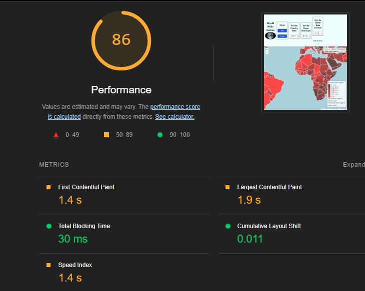
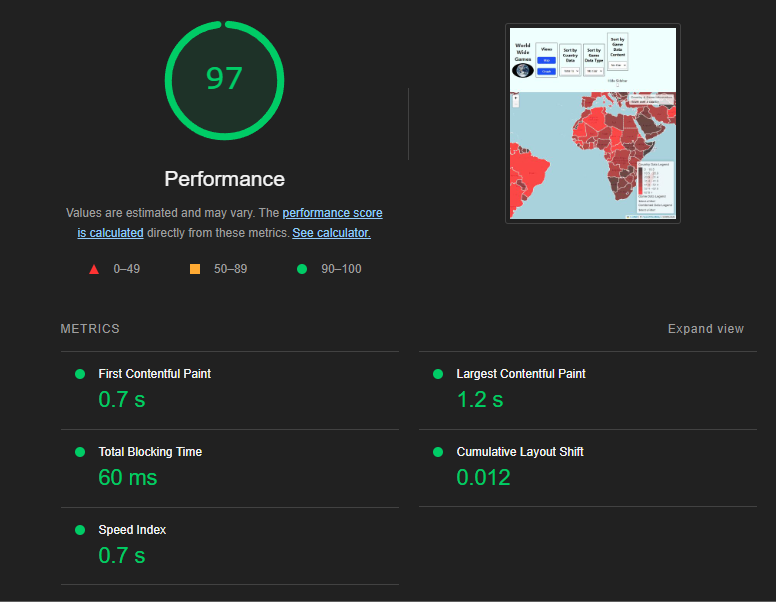

# Performance of <!-- Project Title -->

## Introduction and Methodology

We gathered the data from the network tab on Firefox 
From npx bundler 
We gathered the data from lighthouse using chrome with the desktop version
<!-- Briefly state how you gathered data about app performance, and in what environment 
(which browsers, what browser versions, what kind of device, OS,
width and height of viewport as reported in the console with `window.screen`) -->

<!-- Also report overall impact on whatdoesmysitecost results before and after all your changes -->
Befor result our website was worth $0.04
After our website was worth tbh
## Baseline Performance

<!-- Summarize initial results for each tool that you used. Did the tools
detect all the performance issues you see as a user? -->

## Areas to Improve

## Summary of Changes 

<!-- Briefly describe each change and the impact it had on performance (be specific). If there
was no performance improvement, explain why that might be the case -->

### Memory chache

Lead: Nicholas Pouliezos
It reduced fetch time for 22ms top 8ms

----------------------------------------------------------------------------
### Reducing Bundle size

Lead: Nicholas Pouliezos
Reduced bundle size for *.js from 1.4mb to 447kb
----------------------------------------------------------------------------
### Client-side Caching

Lead: You Ran Wang
Implemented 1 year caching for api calls because data for a country from 2023 will never change.
Opening website on client-side sees colour of country appear instantly.

-----------------------------------------------------------------------------
### Compression on Server Side

Lead: Thiha Min Thein
Added Compression middleware in the app.mjs file, in order to 
compress the network payload and improve the loading time. Here is the before and after:

## Conclusion

<!-- Summarize which changes had the greatest impact, note any surprising results and list 2-3 main 
things you learned from this experience. -->