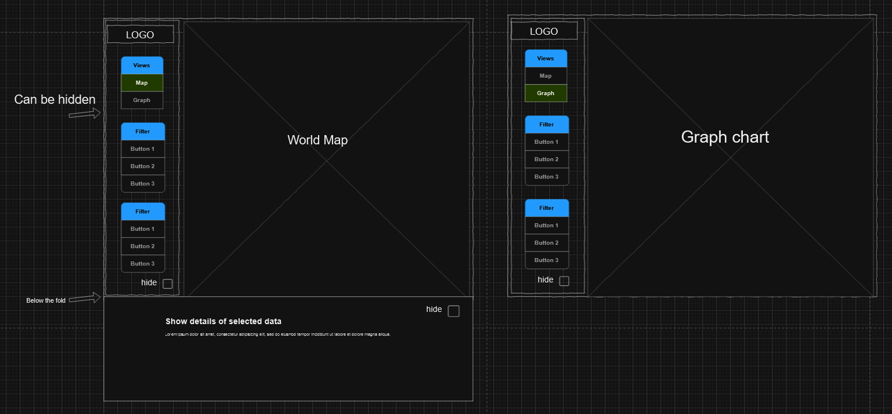
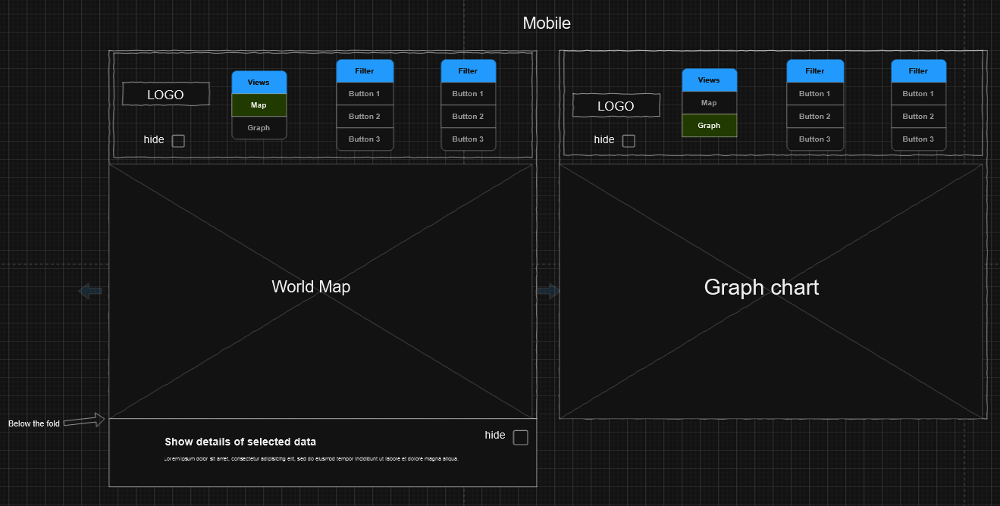

# Country + Games Visualizer

## Data
Country Data:
https://www.kaggle.com/datasets/nelgiriyewithana/countries-of-the-world-2023

Game Types in Countries Data:
https://www.statista.com/outlook/dmo/digital-media/video-games/worldwide

Link to issue with details:
https://gitlab.com/dawson-csy3-24-25/520/section1/teams/TeamI-13/520-project-pouliezos-wang-minthein/-/issues/5

## API
- GET /api/countries
Retrieves a list of all the countries, containing information like the density, population and other useful data.

- GET /api/countries/detail/{country}
Retrieves a specific country's detail

- GET /api/countries-games/{chart}/{name}
Retrives the video game market revenue for all the countries.
Retrives a specific video game type

- Get /api/countries-games/{type}
Retrieves a list of all the countries games

- Get /api/countries-games/detail/{country}
Retrieves a specific country's game detail

## Visualizations
We want the user to learn about countries statistics, such as economic situation, population density, etc. We want to then display how thse factors effects the sale of video games in said country and see which type of games is most played by the population. For instance, mobile games, live service games, Solo games, etc.

Examples of links: 
Urban Population vs What type of games are popular.
GDP vs what types of games are popular.

## Views

##### Desktop

##### Mobile

Above the fold we will have the world map (view 1)
the filter options will be in a side bar that can be shown or hidden (view 2)
A new view will showed the filtered data as a form of charts (view 3)

## Functionality
The user will be able to filter different economic statistics, and different game types (For example. mobile games, pc games, console games, eta).
The user will also be able to click on each country to see a chart of the economic statistics for each country, as well as the different game types a country has.

## Features and Priorities
- One of the core feature is for the map to work. FOr example, the different countries statistics are displayed and some filter features should be implemented ( filters for country stats and video game stats). All the views will need to work, meaning the data below the fold, the sidebar and most importantly the charts.
- Sorting would be somewhat on a lower priority but wanted nonetheless.
- At a close third would be finding a way to make the website aesthetically pleasing.
- Visual animations would come last.

## Dependencies
We are using  [leaflet](https://leafletjs.com/examples/choropleth/) for displaying the map, since we are able to colorize a whole country based on many factors, for instance game data, economic data based on countries and many more.

For charts, we will be using [Chart.js](https://www.chartjs.org/)

As of connecting the view together, we will be using [React Router](https://reactrouter.com/en/main/start/tutorial)